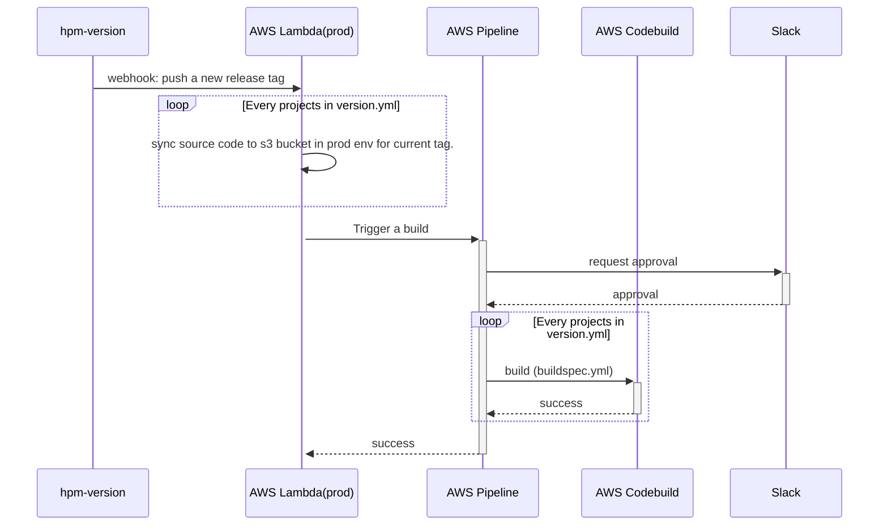

## 甘特图
```
gantt
dateFormat  YYYY-MM-DD
title Adding GANTT diagram to mermaid
excludes weekdays 2014-01-10

section A section
Completed task            :done,    des1, 2014-01-06,2014-01-08
Active task               :active,  des2, 2014-01-09, 3d
Future task               :         des3, after des2, 5d
Future task2               :         des4, after des2, 5d
```


<!-- more -->
## 时序图
```
sequenceDiagram
    Alice->>Bob: Hello Bob, how are you?
    alt is sick
        Bob->>Alice: Not so good :(
    else is well
        Bob->>Alice: Feeling fresh like a daisy
    end
    opt Extra response
        Bob->>Alice: Thanks for asking
    end
```





## 思维导图
### 利用mermaid来画思维导图



- [Hexo 的思维导图插件](https://hunterx.xyz/hexo-simple-mindmap-plugin-intro.html)
  - 前言
  - 使用方法
    - 一
    - 二
    - 三
  - 太长不看
  - 参考资料


```math
e^{i\pi} + 1 = 0
```

<!-- $$
f(x) = \int_{-\infty}^\infty \hat f(\xi)\,e^{2 \pi \xi x} \,d\xi
$$ -->

:joy:

---

<!-- <script>
alert("hello")
</script> -->


## 参考文档
1. [mermaid-js](https://mermaid-js.github.io/mermaid/#/sequenceDiagram)
2. [hexo-math](https://github.com/hexojs/hexo-math)